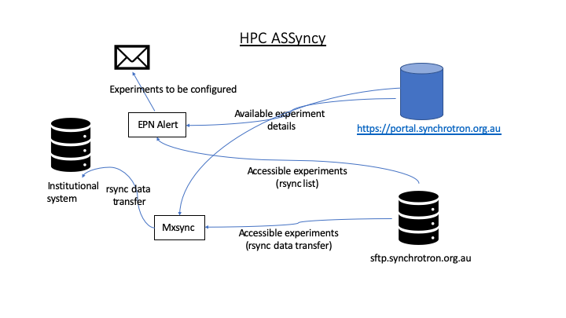

This repository contains two tools that can be used to repatriate Australian
Synchrotron data back to your institution/facility. At a high level they both
produce the same result, but the approach is different. The tools are written in
Python. Choose the one that best suits your requirements.

Why are they different ?
------------------------

At the time of development, the purposes were different as were the
development time frames. Different developers also built the tools.

HPC ASSynchy
============

The main focus of the HPC ASSyncy has been to immediately repatriate data to
MASSIVE (https://www.massive.org.au/) post experiment from the MX beamline at
the Australian Synchrotron. The tool can be used to repatriate data generated by
any beamline and configured to bring back older data.

Written in Python, there are two processes that provide functionality - EPN Alert
and mxsync.

EPN Alert
---------

EPN Alert is a python script executed using a cron job that runs once daily.

.. code-block:: bash

    #Ansible: mxsync crontab
    0 1 * * * /opt/mx_sync/bin/epnalert --config /opt/mx_sync/etc/config.yml

EPN Alert obtains a list of visible EPNs (experiments) using a configured user ID
from 'sftp.synchrotron.org.au'.

The same user ID, is then used to login to the AS Portal
(https://portal.synchrotron.org.au/) to obtain a list of new EPNs for a
configurable range of time. e.g. for the last 30 days.

EPN Alert then compares these lists against the configured list (config.yml) of
known EPNs. If a new EPN is found, an email is sent with the subject
'Unknown ownership of EPNs' containing the principal scientist and a list of the
scientists included in the experiment. By including the scientists, it can be easier
to identify ownership and destination of the experiment data.
The email uses Jinja templating so it can be easily formatted to your requirements.
The destination email address can be configured in the config.yml file.

Mxsync
------

Mxsync can be run manually or setup as a service. It is responsible for repatriating
the data.

.. code-block:: bash

    $ systemctl status mx_sync
    ● mx_sync.service - mx_sync: Australian Synchrotron MX Beamline data repatriation
       Loaded: loaded (/etc/systemd/system/mx_sync.service; static; vendor preset: disabled)
       Active: active (running) since Thu 2020-03-12 12:24:07 AEDT; 5 days ago
     Main PID: 2143461 (mxsync)
        Tasks: 2
       CGroup: /system.slice/mx_sync.service
               └─2143461 /opt/mx_sync/bin/python3.6 /opt/mx_sync/bin/mxsync --config /opt/mx_sync/etc/config.yml --execute

This runs once every 24 hours, but can be configured as required in the config.yml file.

Mxsync builds a list of current EPNs (experiments) based on a date range from config.yml by
querying the Synchrotron Portal.

This list is then checked against ‘ignore.yml’ for datasets that have been successfully
repatriated previously. If found in ‘ignore.yml’ the EPN is skipped.

If an EPN is found needing repatriation, it is added to a list.

The list of EPNs is processed and multiple threads can be run.
For each EPN, an rsync is executed. The return code is checked. If 0 is obtained,
the transfer is successful and the EPN is added to ‘ignore.yml’, if not, the EPN
is kept in a list to retry at the next run.

HPC ASSynchy has detailed logging. The logging level is configurable in the
config.yml file. e.g. DEBUG, INFO.

There are three log files: email.log, epnalert.log and sync.log

 - Email.log details when an EPN Alert email is sent.
 - Epnalert.log details the processing used to generate the email.
 - Sync.log details the processing of ‘mxsync’. This log can be used to view the output from rsync.

Please refer to `HPC_ASSyncy <HPC_ASSyncy/README.rst>`_  for further details.

MeRC ASynchy
============

The main focus of the MeRC ASynchy was to repatriate all historical data from
the Australian Synchrotron, however it could be used to repatriate new data.

MeRC ASynchy uses a database to store the experiments to be repatriated. Initial
population of this database can be performed by the AS-Walker service. The
results of the rsync process are captured and stored in the database.

.. figure:: MeRC_Asyncy/MeRC_Asyncy.png

AS-Walker
---------

AS-Walker (https://github.com/monash-merc/as-walker) traverses the Australian
Synchrotron SFTP service and gathers information regarding the available EPNs.
The data gathered is kept in an SQLLite database that supports the values: epn,
size, path, and modified (datetime). AS-Walker produces multiple SQLLite DBs, which
can be manually merged using SQLlite functionality. Please see
https://sqlite.org/ for details.

MeRc ASynchy
------------

With the database populated by AS-Walker, Merc ASynchy is used to repatriate the
data.

Options used to run MeRC ASynchy:

.. code-block:: bash

    (asynchy) ubuntu@synchy:~$ asynchy sync --help
    Usage: asynchy sync [OPTIONS]

      Sync data from a configured asynchy remote

    Options:
      --dest TEXT        Destination directory  [default: ./]
      --src_prefix TEXT  Prefix to append to EPNs to create their path  [default:
                         /]
      --order TEXT       Order of transfers by date  [default: ASC]
      --limit INTEGER    Number of EPNs transfer  [default: 50]
      --retry INTEGER    Number of time to retry SSH connection  [default: 0]
      --parallel         Use multiple processes for parallelisation  [default:
                         False]
      --threads INTEGER  Number of threads to use. If parallel, the number of
                         Python processes to use  [default: 1]
      --partial          Enable partial transfers  [default: False]
      --compress         Enable compression prior to transfer  [default: False]
      --help             Show this message and exit.

A sample execution command:

.. code-block:: bash

    ubuntu@synchy:~$ source activate asynchy
    (asynchy) ubuntu@synchy:~$ asynchy sync --dest /srv/as/vault/data/ --src_prefix /data --limit 30 --retry 5 --parallel --threads 2

Please refer to `MeRC_Asyncy <MeRC_Asyncy/README.rst>`_  for further details.
